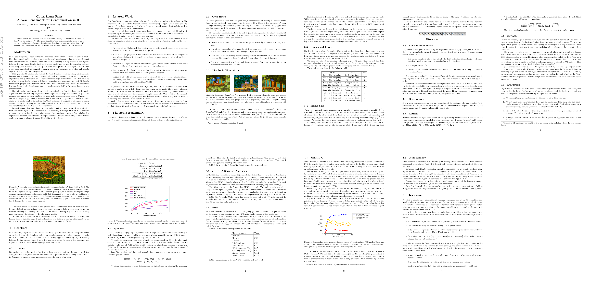

# Gridify Thumbnails from PDF

**What does it do**. 
Extract the thumbnails of a PDF file and arrange them into a grid.  
**Why though**.
Useful in research paper highlights to enable the reader to see the overall structure and content of the paper from a quick glance without leaving the page.

**Hyperparameters**. The number of pages to be extacted as thumbnails from the PDF, the dimensions of the grid as well as the final image resolution are all configurable.

*Code inspired from [Andrej Karpathy](https://twitter.com/karpathy)'s [Arxiv Sanity Preserver](http://www.arxiv-sanity.com/) [code](https://github.com/karpathy/arxiv-sanity-preserver).*

## Example usage
In order to extract a 6-column grid of thumbnails from the first 11 pages of the given PDF file `my_file.pdf`, with a resolution of 100 DPI, use the following command:

```shell
python gridify_thumbs.py \
    --pdf=my_file.pdf \
    --npages=11 \
    --ncols=6 \
    --dpi=100
```

For this example, we take the
*"Gotta Learn Fast: A New Benchmark for Generalization in RL"*
[paper](https://arxiv.org/abs/1804.03720) from 
[Nichol](https://twitter.com/unixpickle) et al. as PDF file.

The resulting thumbnail grid:



